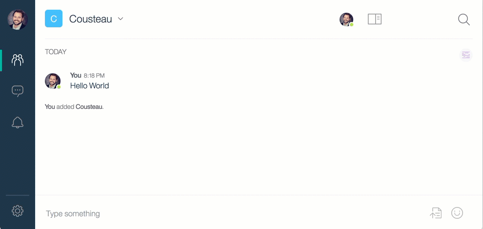

# IBM Watson Workspace Cognitive Explorer Bot

Nicknamed Cousteau, this bot allows a user to explore the cognitive annotations available in IBM Watson Workspace.  It is an educational tool so that developers can learn about Workspace's [Information Extraction](https://workspace.ibm.com/developer/docs) capabilities.

## Usage

Once added to a space, Cousteau will indicate where cognitive annotations exist. These are seen as underlined text in a message. Clicking on the text will reveal a series of buttons corresponding to available annotations. Selecting an annotation button lists the metadata as a series of cards.

Use the  button to create a chatbot on IBM Bluemix.
